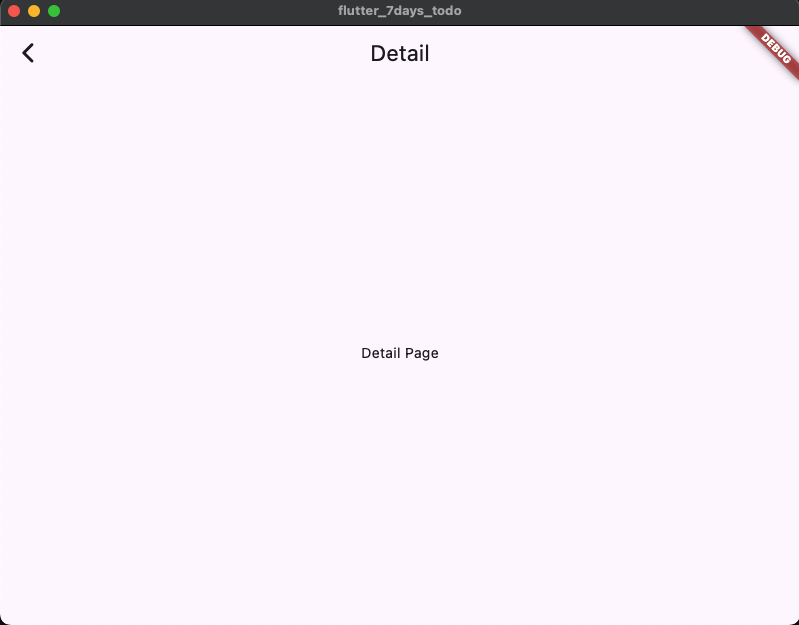

# Day 1 — 프로젝트 세팅 & 라우팅

## 🎯 학습 목표
- Flutter 환경 점검 (`flutter doctor`)
- Cursor IDE에서 프로젝트 생성 및 실행
- Home ↔ Detail 화면 라우팅
- Hot reload 체험

## 📝 코드 설명

### main.dart
```dart
void main() => runApp(const MyApp());
````

* `main()` 함수: Dart 프로그램 시작점
* `runApp()` : Flutter 앱 위젯 트리의 루트 실행

```dart
MaterialApp(
  title: '7days TODO',
  routes: {
    '/': (_) => const HomePage(),
    '/detail': (_) => const DetailPage(),
  },
);
```

* `MaterialApp`: Flutter 앱의 기본 뼈대 (테마, 라우팅, 로컬라이제이션 포함)
* `routes`: URL-like 문자열 키로 화면을 등록
* `/` = 기본 진입 화면, `/detail` = 두 번째 화면

```dart
Navigator.pushNamed(context, '/detail');
```

* `Navigator`: 화면 전환을 담당하는 Flutter 내장 위젯
* `pushNamed`: 등록된 경로(`/detail`)로 이동, 스택 기반

---

## 🔥 오늘 배운 점

* Flutter 앱은 **위젯 트리**로 UI를 그린다.
* 라우팅은 **routes map + Navigator**로 처리된다.
* Hot reload는 **저장 즉시 화면 반영**되는 Flutter의 핵심 장점.
* 에뮬레이터/실기기 실행까지 포함해서 **개발 사이클**을 몸으로 익혔다.

---

## ✅ DoD (완료 정의)

* [x] `flutter doctor` 정상 통과
* [x] 기본 앱 실행 성공
* [x] Home → Detail 네비게이션 동작
* [x] Hot reload로 UI 변경 즉시 반영

---

## 📸 스크린샷


